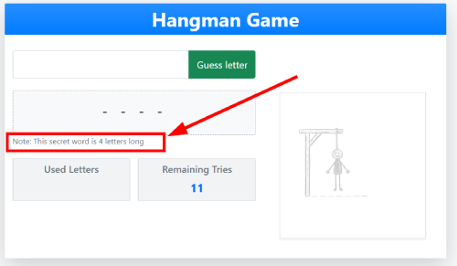

# Hangman
This little Hangman game is built with .NET Core 8 with MVC architecture and Razor views. Much of the game logic and functionality uses Javascript.  

### Technologies

## Table of Contents
- [Description](#description)
- [Rules of Game](#rules-of-game)
- [Getting Started](#getting-started)
- [Usage](#usage)
- [Credits](#credits)

## Description
Hangman is a guessing game for two or more players. One player thinks of a word, phrase, or sentence and the other(s) tries to guess it by suggesting letters or numbers within a certain number of guesses. Originally a paper-and-pencil game, there are now electronic versions. My version automatically chooses a secret word for the user to guess from a list of 100 words and simply lets the user know the number of letters in the word.  

## Rules of Game
The word to guess is represented by a row of dashes representing each letter or number of the word. Rules may permit or forbid proper nouns (such as names, places, or brands) or other types of words (such as slang). If the guessing player suggests a letter which occurs in the word, the other player writes it in all its correct positions. If the suggested letter does not occur in the word, the other player adds (or alternatively, removes) one element of a hanged stick figure as a tally mark. Generally, the game ends once the word is guessed, or if the stick figure is complete—signifying that all guesses have been used.

The player guessing the word may, at any time, attempt to guess the whole word. If the word is correct, the game is over and the guesser wins. Otherwise, the other player may choose to penalize the guesser by adding an element to the diagram. If the guesser makes enough incorrect guesses to allow the other player to complete the diagram, the guesser loses. However, the guesser can also win by guessing all the letters that appear in the word, thereby completing the word, before the diagram is completed.

## Getting Started
This project is a .NET Core MVC web application. To run it outside of Visual Studio, you'll need the **.NET Core SDK** installed on your machine (the version that is compatible with this project - 8.0). 

1. **Get the code (cloning the repository)** - You'll first need to get the code from Github. Follow these steps from your command line interface (CLI), such as Command Prompt, Powershell or Bash: 
`git clone https://github.com/evanmalherbe/Calculator.git`
2. **Navigate to project directory** - Now use the `cd` command to move into the directory that contains the project's `.csproj` file. 
`cd Calculator`
3. **Restore dependencies (optional but recommended):** Run the following command to download any necessary packages and dependencies. This is often done automatically, but this makes sure everything is in place. 
`dotnet restore`
4. **Run the application:** Execute the project using the `dotnet run` command.  `dotnet run`
5. **Access the application:** Once the application starts, the console output will show the urls where the app is listening. Usually, it will be something like `http://localhost:5000` or `http://localhost:5001`. Open your web browser (E.g. Microsoft Edge, Google Chrome etc) and type that address into your browser address bar to use the calculator.

## Usage
Once you open the project in your browser `http://localhost:5000` (or similar), you will see the calculator with it's familiar layout of buttons. Simply use the number keypad on your keyboard or use your mouse to click the buttons on screen. See figure 1 below. 

## Credits
This project was created by Evan Malherbe - October 2025 - [GitHub profile](https://github.com/evanmalherbe)
